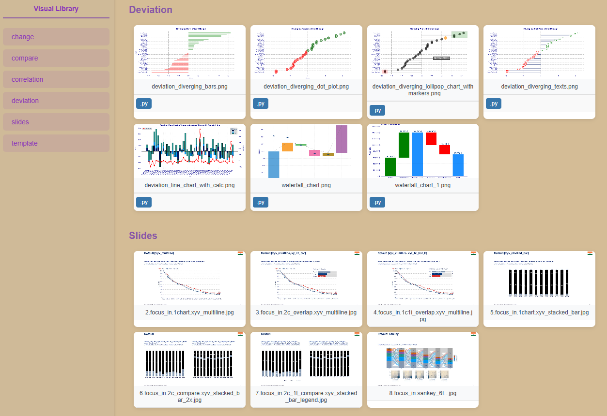

# Visual library (vl)

### About

A reference point for charts and graphs.

Build visualizations leveraging code (.py, .R, .bas) with least time and effort.

### Structure

Includes ready to use codebase plugged in an .html page for easy access and usage.

{: .center style="height: 500px; width: Auto; border-radius: 5px;" loading=lazy}

### Demo

Demo in `examples\vl.py`.
