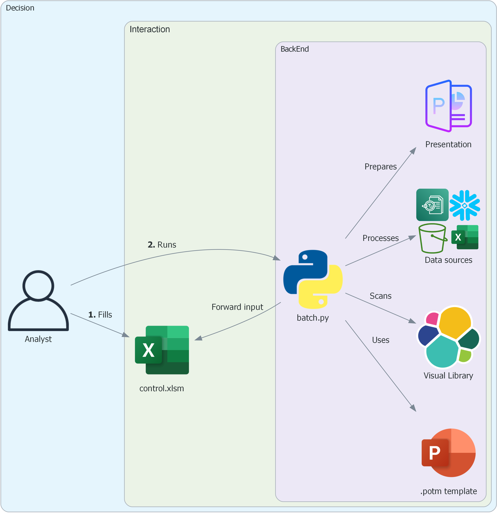
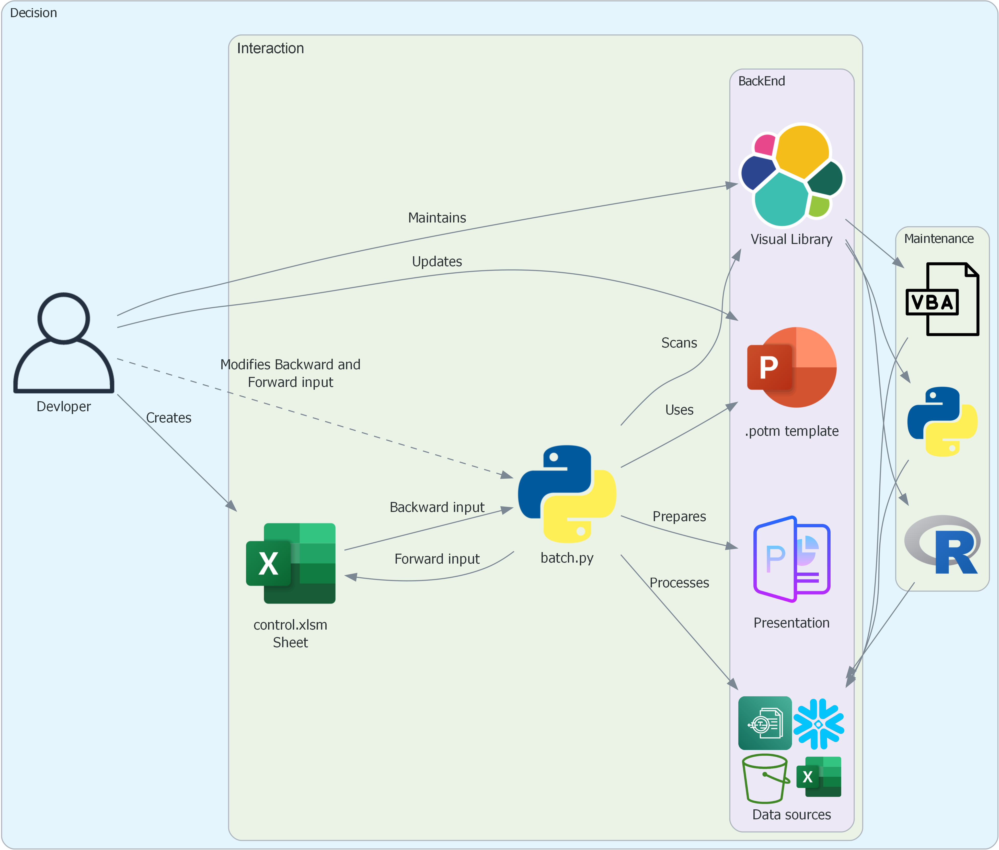
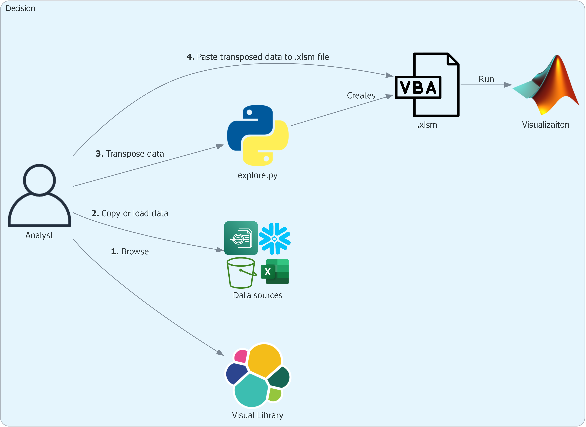
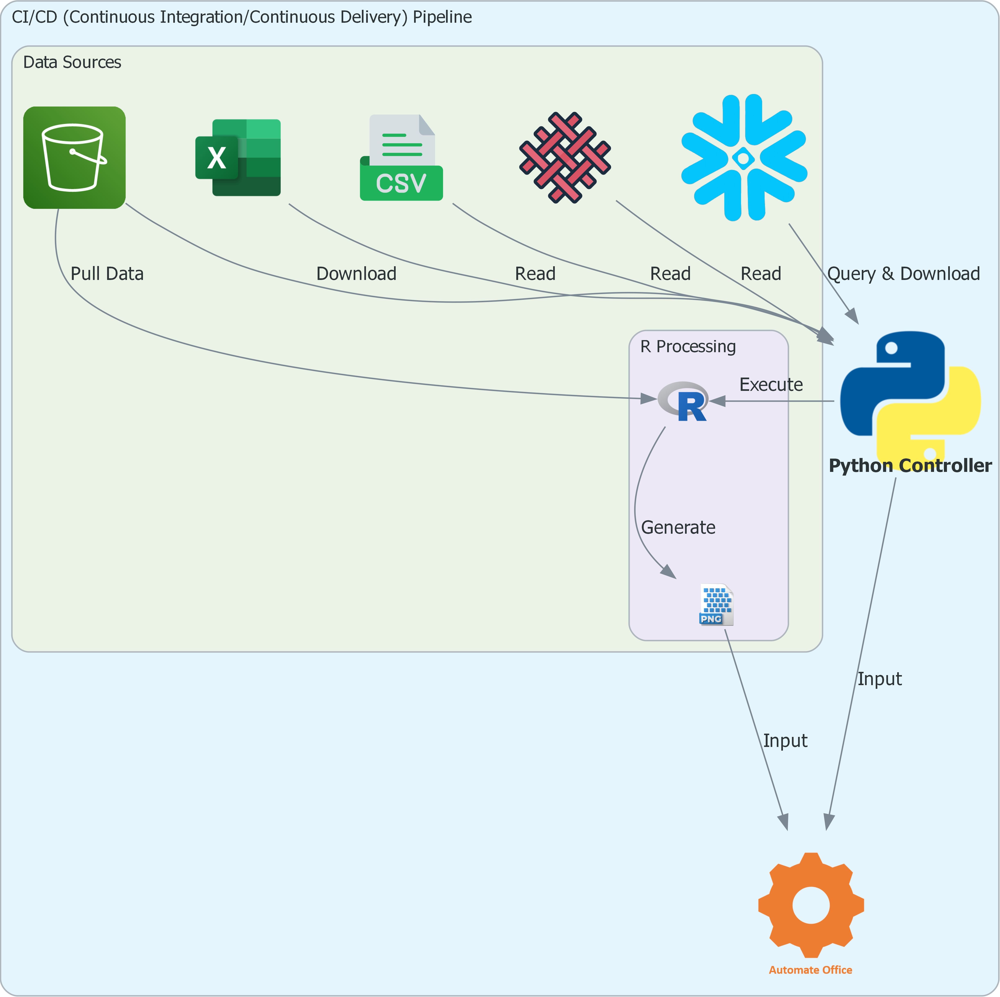

# Automate office[^1]

[^1]: Please move around the template master elements as the output .pptx file is less organzied.


## About

`Automation` to prepare `visualization(s)` and `slide deck at scale`.


```yaml linenums="0" title="Project structure"
┣━ code                 : User modified main program(s)
┃   ┣━ ao_batch.py          : Create .pptm presentation in batch mode.
┃   ┣━ ao_explore.py        : Create individual charts/graphs as in Visual Library.
┃
┣━ input                : User defined directory
┃   ┣━ ____control.xlsm     : Input to align slide(s) and their content.
┃   ┣━ data/                : Input .csv files.
┃   ┣━ img/                 : Input image files.
┃   ┗━ templates/           : Reusable .potm template
┃
┣━ output:              : Output file format
┃   ┗━                      : <report-name>__<yyyymmdd>_<hhmm>.pptm
```

Automate office integrates `excel vba`, `R` and `powerpoint presenation` elements using `python`.

The structure is build around taking control of placeholder elements of powerpoint master slide.

The input to prepare powerpoint deck is structured through a control file.


## Demo

- `examples\ao_batch.py`: Build slide deck.
- `examples\ao_explore.py`: Build individual visualizations.


## Target

`Process transformation` by `eliminating manual steps` to prepare `visualization(s)` and `slide deck(s)`.

1. The automation targets to save `~30%` of the time taken to work on new presentation related tasks and `~80%` of the time on repeat tasks.
2. `Standardization` to bring much `desired consistency` to `insights generated by the team`.
3. Adopting `script based visualization` that are faster and equal to or better than existing options.
4. `Building product` that `saves teams time` and `brings new innovation(s)` enabling `generating better insights` *faster*.


**New tasks**


{: .center style="height: 50%; width: 50%; border-radius: 5px;" loading=lazy}

**Repeat tasks**


{: .right style="height: 50%; width: 50%; border-radius: 5px;" loading=lazy}


## Design

Project is designed on following ground rules:

0. `What you see is what you get`: Visualization or Slide option in Visual Library to guide in choosing available options.
1. `Limited to no learning curve`: Structure the project that anyone can use the automation irrespective of lack of knowledge of a language.
2. `For a task choose software that works best`: If excel works better vs any other software then we do that task in excel.
3. `Scale, Compatibility, flexibility`: Project is designed to be easliy scaled to include large number of visualization(s) providing intutive access to resources needed to build custom visualization and powerpoint presentations. We have tested the codebase across different system combinations (windows 10, 11; Microsoft Office 2016, 2019, 2021, 365, Python 310, 311, 312, 313, R 4.4.3) ensuring programs do not break on known environments. Anyone can contribute to the visualization library following simple rules as laid under `developer` section.
4. `End-to-end automated integration`: All components of the project are end-to-end automated, E.g. Visual library is autogenerated using python code so no manual maintenace or development. The automated components are integrated, E.g. The data processing takes color input from the PADAWA docs data table. Most of the components of the automation feed on already existing resources in other atuomation projects (`padawa_docs`, `searchx`).

**Project uses following softwares:**

1. `.py`: Python to control the project.
2. `.bas`: VBA to create visualizations in Excel.
3. `.potm`: Powerpoint to create reusable slide templates.
4. `.md`: Markdown integrates the project and make it easily accessible.
5. `.R`: R to create visualizations not possible through Excel (vba) or Python respectively.


## Usage

### batch.py

{: .center style="height: 40%; width: 40%; border-radius: 5px;" loading=lazy}

In batch mode the sheet named `calibration` in `____control.xlsx` file is used to control the number of slides, type of charts, formatting, text and image input to a presentation.

Just like `explore.py` the analyst can see if certain visualizations or slides are present in `Visual library`, pick and choose the charts and slides that are desired and reference the same in `batch.py` file.

<hr>


**Developer**

{: .center style="height: 40%; width: 40%; border-radius: 5px;" loading=lazy}

A developer needs to understand complex relationship between different elements of the project:

1. `Visual library`

    - The code and output should be the same named file e.g. `bar.bas` and its corresponding `bar.jpg' file.
    - Only `.bas` files to have `.jpg` output, other code can have other output types like `.png'.
    - Keep the variable names that control the charts consistent across codes irrespective of language.
    - Keep things organized in folders with parent being `visaul_library` and child folders like `compare`, `distribution`, `flow` and so on.
    - Ensure no repeats in the slide generated by `calibration` sheet.

2. `____control.xlsm`

    - Maintain the structure of the sheets in the control file.
    - Understand that the `master` slide and output in folder `output\learn` are related to how this file is derived.

3. `batch.py`

    - Understand the dependencies and their relationship with all other elements that the program works with.

<hr>


### explore.py

{: .center style="height: 50%; width: 50%; border-radius: 5px;" loading=lazy}

1. `Browse`: Check if a visualization that is expected exists in the Visual library.
2. `Copy or load data`: Copy data into clipboard from the data source(s).
3. `Transpose data`: Run `explore.py` `Step2` to transpose data into `xyzv` convention.
4. `Paste transposed data to .xlsm file`: Run `explore.py 2.3` and paste transposed data to `cell A1` in file generated when initializing `explore.py`.

<hr>

### Pipeline


{: .center style="height: 50%; width: 50%; border-radius: 5px;" loading=lazy}


`CI/CD (Continuous Integration/Continuous Delivery) Pipeline` approach allows us to do as much as possible, an `end to end integration`, eliminating manual data preparation steps in the process.


## Future development

0. Expand `Visual library` to include most of the frequently used visualizations.
1. Close project libraries for targeted use (right now code is open).
2. Development of `adhoc.py` (currently code heavy) just in line with `explore.py` and `batch.py`.
3. Comments on slides to be powered by either of the feasible solution(s):
    - Local `GPT` (Generative Pre-trained Transformer) engine.
    - `ML` (machine learning) based model trained on `.ppt* title corpus` leveraging `searchx`.
    - `MCP` (Model Context Protocol) process deployment.


